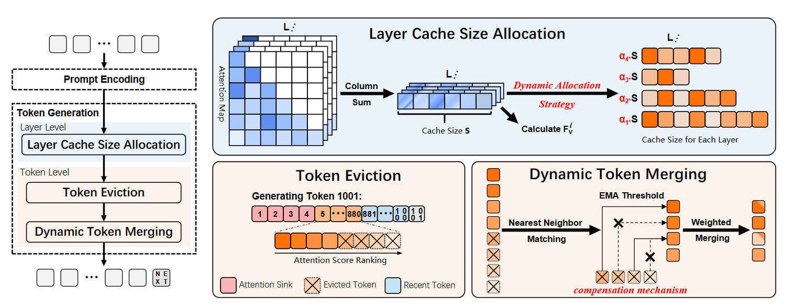

# $D_{2}O$: Dynamic Discriminative Operations for Efficient Long-Context Inference of Large Language Models

<div align="center">
 <br>
</div>


The code for ICLR 2025 paper: [$D_{2}O$: Dynamic Discriminative Operations for Efficient Long-Context Inference of Large Language Models](https://openreview.net/forum?id=HzBfoUdjHt).
<p align="center">
  📃 <a href="https://openreview.net/forum?id=HzBfoUdjHt" target="_blank">[Paper]</a> • 💻 <a href="https://github.com/AIoT-MLSys-Lab/d2o" target="_blank">[Github]</a> • 🤗 <a href="https://huggingface.co/papers/2406.13035" target="_blank">[Huggingface]</a> 
</p>
<h5 align="center"> If you find our project helpful, please give us a star ⭐ on GitHub to stay updated.</h5>


## Setup Environment
We recommend using Anaconda to create a new environment and install the required packages. You can create a new environment and install the required packages using the following commands:
```bash
pip install -r requirements.txt
conda create -n d2o_v2 python=3.10
conda activate d2o_v2
pip install --upgrade pip  # enable PEP 660 support
```
## Quick Step to Run the Code
You can run the inference code using the following command to run the Longbench sample:
```bash
CUDA_VISIBLE_DEVICES=0 python run_pred_long_bench_sample.py --model_name_or_path meta-llama/Meta-Llama-3-8B \
    --cache_dir /your_hf_home_path \
    --use_d2o True \
    --model_type llama3 \
    --hh_ratio 0.1 \
    --recent_ratio 0.1 \
    --action_name d2o_0.2 \
    --e True 

```
- `cache_dir` stores your model weights.  
- `use_d2o` specifies the execution strategy name.  
- `hh_ratio` refers to important tokens in our main paper.  
- `recent_ratio` represents the proportion of the window closest to the generated token.  

Then, evaluate the results:
```bash
python eval_long_bench.py --model Meta-Llama-3-8B_d2o_0.2 --e 
```
  
For tasks related to `lm-evaluation-harness` [GitHub Repository](https://github.com/EleutherAI/lm-evaluation-harness),  
we recommend using the latest version by running:  

```bash
git clone https://github.com/EleutherAI/lm-evaluation-harness.git
```
Then, follow the installation instructions provided in the repository and execute our algorithm accordingly.

## Citation
```bibtex
@article{wan2024d2o,
  title={D2o: Dynamic discriminative operations for efficient generative inference of large language models},
  author={Wan, Zhongwei and Wu, Xinjian and Zhang, Yu and Xin, Yi and Tao, Chaofan and Zhu, Zhihong and Wang, Xin and Luo, Siqi and Xiong, Jing and Zhang, Mi},
  journal={arXiv preprint arXiv:2406.13035},
  year={2024}
}
```

or 

```bibtex
@inproceedings{
wan2025textdtexto,
title={\${\textbackslash}text\{D\}\_\{2\}{\textbackslash}text\{O\}\$: Dynamic Discriminative Operations for Efficient Long-Context Inference of Large Language Models},
author={Zhongwei Wan and Xinjian Wu and Yu Zhang and Yi Xin and Chaofan Tao and Zhihong Zhu and Xin Wang and Siqi Luo and Jing Xiong and Longyue Wang and Mi Zhang},
booktitle={The Thirteenth International Conference on Learning Representations},
year={2025},
url={https://openreview.net/forum?id=HzBfoUdjHt}
}
```